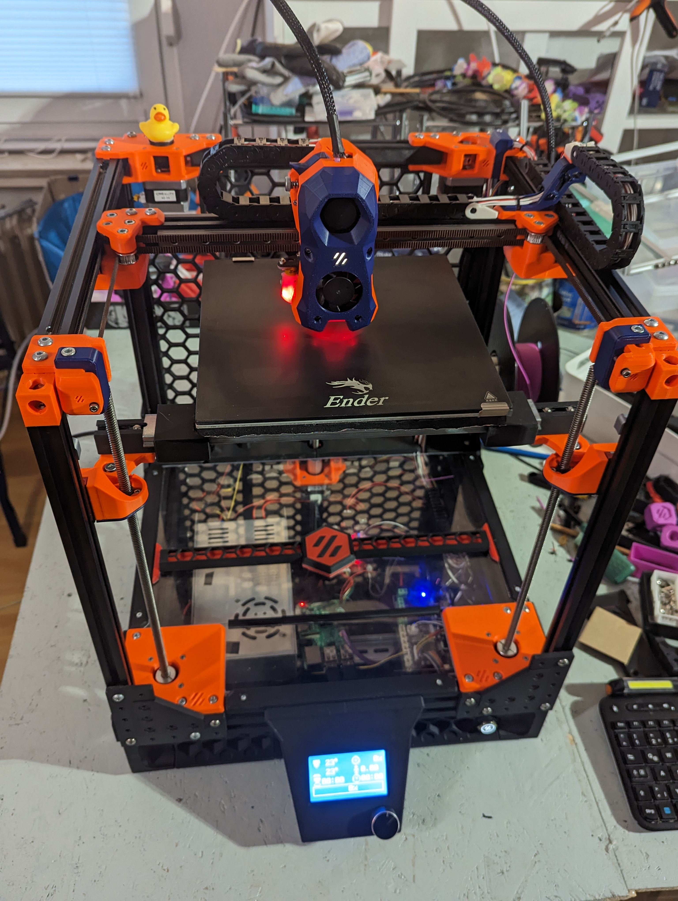
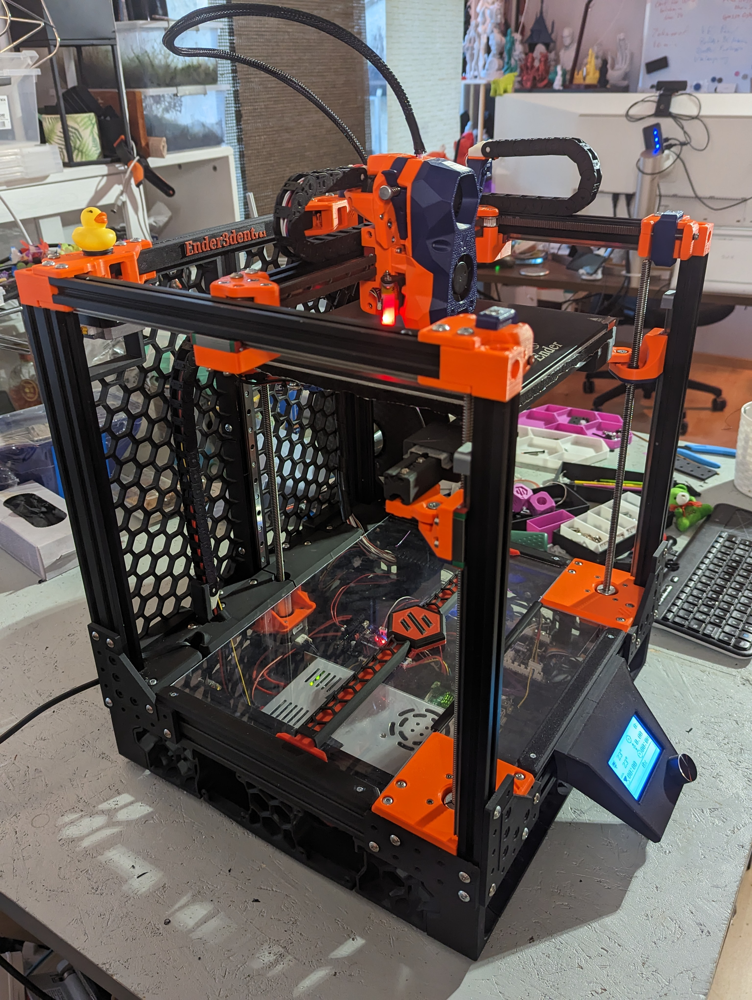

# Ender3dent
Your 3D printer has the rights to be whatever tool it was to be.

## Proof of Concept

VT.979 aka Original Ender3dent v0.1

https://vorondb.com/printer/Ender3dent

## BOM
1. buy 250mm Trident BOM, leave out things you already own, like if you own 3 leadscrews then skip the leadscrew steppers
2. buy wire cutters and crimping tools (Microfit, JST, Ferrules)
3. (optional but highly recommended) buy a Trident frame and build a Trident
4. if you skipped no 3 then build extrusion with a length of 2x 400mm, 1x 330mm, 1x370mm, 1x 260mm (this can be printed)

I build mine from scraps/leftovers and there is a possibility i change my mind to a "2xEnder3 to 1xTrident" Conversion.
